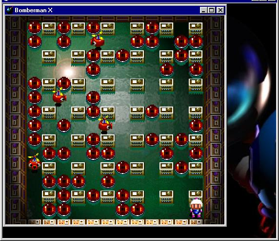



## Visual Bomberman X \(Preview\)

### Description

Forget atomic bomberman for PC that takes 55 megs.

(This takes 464kb zip compressed)

This Visual Bomberman X uses direct X 7 and 24-bit color.(65.7% Bomberman emulator)

This game ROCKS like hell...looks little bit like snes bomberman game.

(Tested 3 computers)

Everything works fine: the graphics looks good, excellent control, good speed(unless if have faster computer),and good AI.

Reqirements: PII 266 or higher, Direct X7, 24-bit color mode.(if you don't meet this reqirements don't download it)

Add your muiltplayer code, graphics, level, character images, your bomberman style, etc.

Sorry,I didn't have time to compress into exe. Just download this program and run the game.

Hot Direct X game... This should be visual basic game of the year. Vote for me.
 
### More Info
 
require 24-bit color mode. (using under 16-bit color won't make the game look good.

             |
---                |---
**Submitted On**   |2001-02-23 17:43:54
**By**             |[VB COMEDIAN](https://github.com/Planet-Source-Code/PSCIndex/blob/master/ByAuthor/vb-comedian.md)
**Level**          |Intermediate
**User Rating**    |4.2 (46 globes from 11 users)
**Compatibility**  |VB 5\.0, VB 6\.0
**Category**       |[DirectX](https://github.com/Planet-Source-Code/PSCIndex/blob/master/ByCategory/directx__1-44.md)
**World**          |[Visual Basic](https://github.com/Planet-Source-Code/PSCIndex/blob/master/ByWorld/visual-basic.md)
**Archive File**   |[CODE\_UPLOAD154202242001\.zip](https://github.com/Planet-Source-Code/vb-comedian-visual-bomberman-x-preview__1-21283/archive/master.zip)

